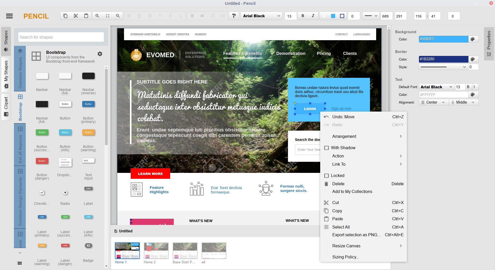

About The Next Version
==========

Pencil V3 is a rewrite of Pencil that aims to fix major performance and scalability issues of the application. The new version is under heavy development and we are expecting GA builds in June. The following list summarizes important changes in the new version:

  * Pencil V3 uses Electron instead of Mozilla XULRunner as the runtime. We expect that by moving into this Nodejs-based environment, the Pencil source code can be much easier for all fellow developers to play with. The fact that Mozilla XULRunner is outdated is also a reason for the movement.
  * A new, zip-based file format was introduced to support large documents and better embedding of external bitmaps/resources.
  * A new mechanism for page management that dramatically reduces memory usage for large documents.
  * Document pages can now be structured into a tree-like model.
  * Custom fonts can now be embedded into Pencil .epz documents
  * Printing and PDF export will be improved to support all platforms and with many options
  * New UI approach


Setting up
==========

Pencil uses [Atom Electron](http://electron.atom.io/) as the runtime, follow the these steps to setup the environment:

  * Clone this repository
  * Make sure you are using *nodejs 5+*
  * Install dependencies:

      ```bash
      $ npm install
      ```
  * Start Pencil using the prebuilt version of Electron

      ```bash
      $ npm start
    ```


Supported Platforms
==================

OS X
----

Only OSX 64bit 10.9 and later are supported.

Windows
------

Windows 7 and later are supported, older operating systems are not supported (and do not work).

Linux
-----

* Tested
    * Ubuntu 12.04 and later
    * Fedora 21+
    * Debian 8+
* Packages
    * **Arch Linux** - [pencil](https://aur.archlinux.org/packages/pencil/) on the [Arch User Repository](https://aur.archlinux.org/).
